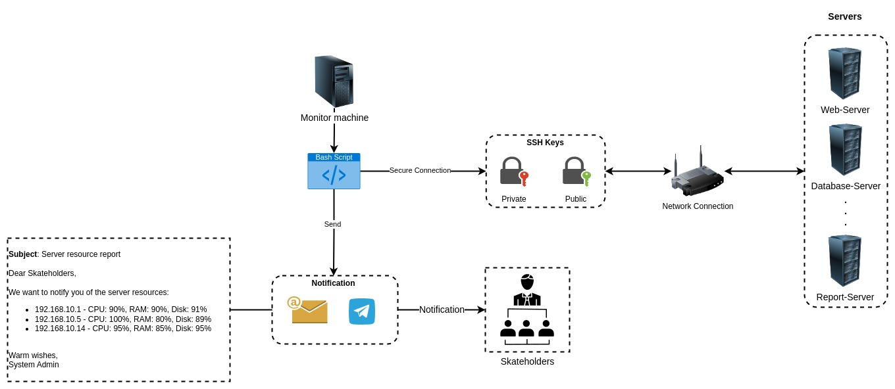

# Butomation
---

Three projects with automate tasks with Bash script.
 

## Rotify (Resource Notify)
---

Instead of checking system every minute. [Rotify](./Rotify) bash script will notify adminstrator whenever the system hit the resource limit via telegram message.

 

 

## Shipify (Ship notify)
---

Automate backup the file system to other server via secure copy (aka scp) with set a specific schedule to execute the bash script via cron-job. After the backup finish the notification is send to the team via telegram-bot.

 

 

