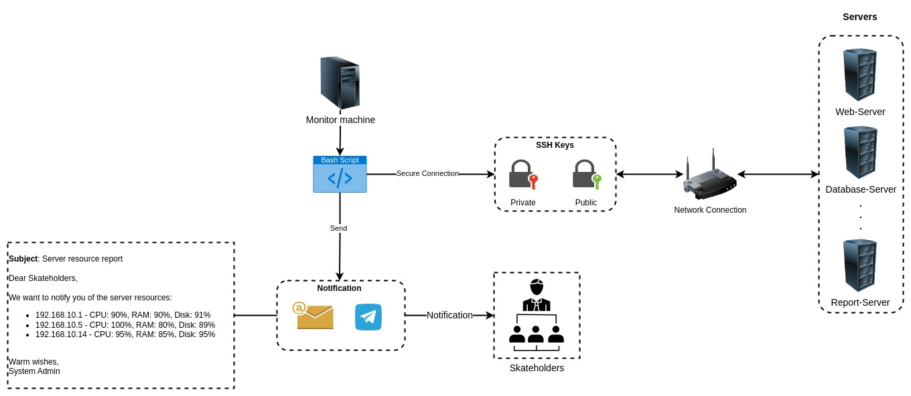

# Rotify
---

Resource notify (aka Rotify), this is an automate bash script that send a notification whenever the system resource is low (set threshold) via telegram bot.



### prequiresite:

```
sudo apt-get update
sudo apt install sysstat
```

*Note: Please replace the text inside **chatid** and **token** with your telegram **chat_id** and **token_id** >> Learn more about telegram-bot: [Telegram-Bot](https://sendpulse.com/knowledge-base/chatbot/telegram/create-telegram-chatbot).